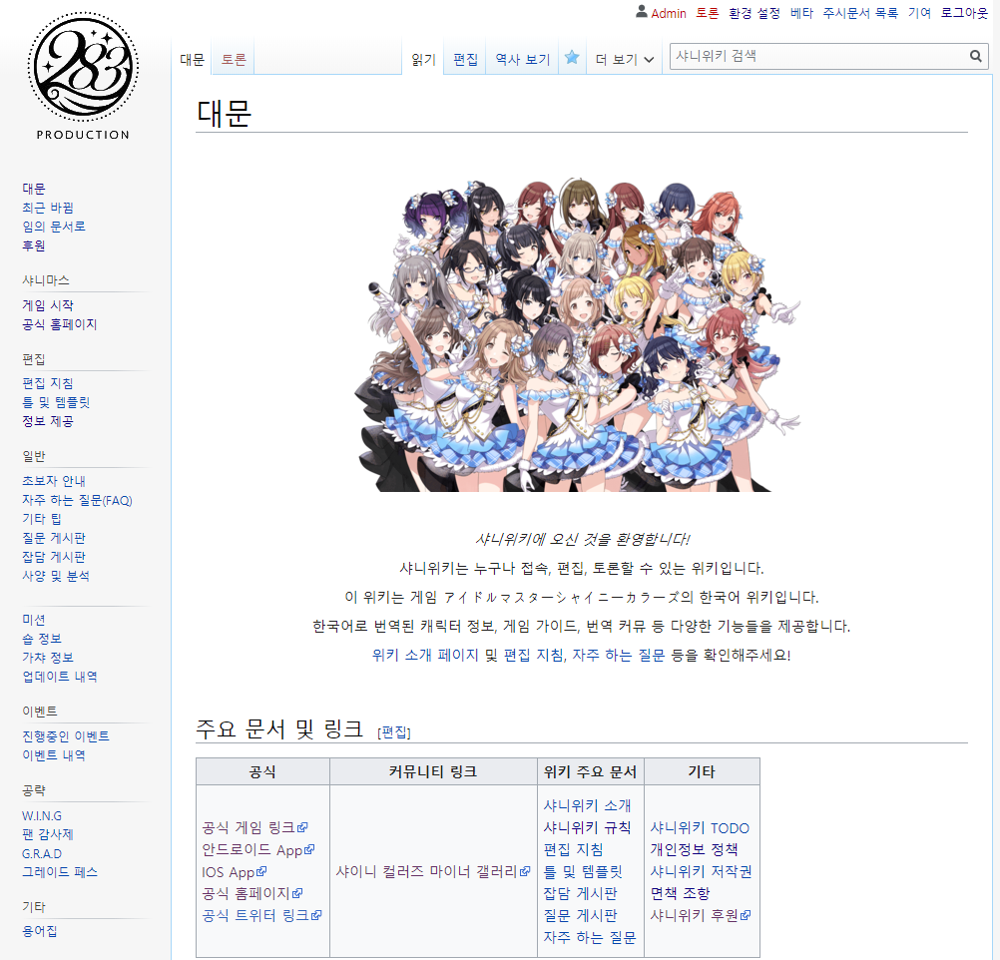

# 샤니위키_이슈
본 레포는 한글 [샤니위키](http://shinycolors.info)의 이슈들을 모으고, 해결하기 위한 레포입니다.

부담 없이 자유롭게 이슈를 작성해주세요.

 

샤니위키는 게임  **아이돌 마스터 샤이니 컬러즈** 의 한국어 위키입니다.   
한국어로 번역된 캐릭터 정보, 게임 가이드, 번역 커뮤 등 다양한 기능을 제공하고 있습니다.   

위키 소개 [페이지](http://shinycolors.info/Project:소개) 및 
[편집 지침](http://shinycolors.info/Help:편집_지침), 
[자주 하는 질문](http://shinycolors.info/자주_하는_질문) 등을 확인해주세요.

# Shinywiki_issues
Repo for handling issues of [ShinyWiki](http://shinycolors.info)

Feel free to create any issue related to ShinyWiki

 

ShinyWiki is korean wiki for game **Idolm@ster Shiny Colors**.  
This wiki provides korean translation of ShinyColors including character info, game guide, communication texts.  

Please visit wiki [MainPage](http://shinycolors.info/Project:소개), 
[How To Edit](http://shinycolors.info/Help:편집_지침) and
[FAQ](http://shinycolors.info/자주_하는_질문). 
